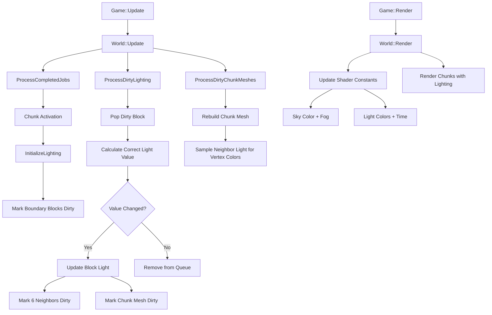
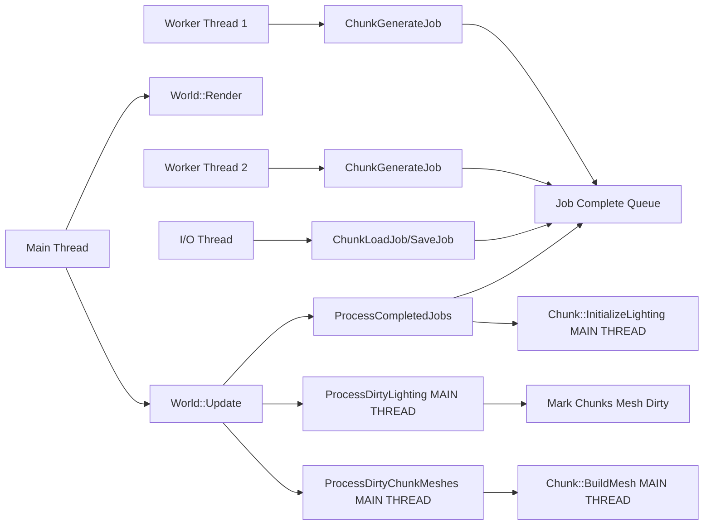

# Design Document - Assignment 5: Rendering and Lighting

## Overview

Assignment 5 transforms SimpleMiner from a textured voxel world into a dynamically-lit environment with volumetric lighting, atmospheric effects, and precise block interaction. This design implements a Minecraft-inspired dual influence map lighting system where outdoor skylight and indoor artificial light propagate independently through the world, creating realistic illumination for both surface exploration and underground cave systems.

The core technical challenge is extending the ultra-lightweight 1-byte Block class to 3 bytes while maintaining 60 FPS performance, implementing efficient cross-chunk light propagation using a dirty queue algorithm, and integrating vertex-based lighting into the DirectX 11 rendering pipeline.

**Key Design Principles:**
- **Minimal Memory Overhead**: Block expansion from 1→3 bytes (3x increase acceptable per assignment specs)
- **Frame-Budget Lighting**: All dirty light processing must complete within 8ms per frame
- **Thread-Safe Architecture**: All DirectX 11 and lighting operations on main thread only
- **Seamless Chunk Boundaries**: Light propagation and raycasting work transparently across chunk edges
- **Incremental Integration**: Build on existing Assignment 4 chunk system without major refactoring

## Steering Document Alignment

### Technical Standards (tech.md)

**Note**: No formal tech.md exists for SimpleMiner. However, the codebase follows these established patterns:

- **C++20 Standard**: Modern C++ with `/std:c++20` compiler flag
- **Engine Separation**: Game code includes Engine headers, never vice versa
- **Flyweight Pattern**: Block (3 bytes) references shared BlockDefinition data
- **RAII Resource Management**: DirectX 11 buffers managed with explicit lifecycle
- **Mutex-Protected Shared State**: Chunk maps use `std::mutex` for thread safety
- **Const Correctness**: Render methods marked `const`, mutators are non-const

**Assignment 5 Adherence:**
- Block class remains POD (Plain Old Data) - 3 bytes, no vtable
- Lighting system uses C-style bit manipulation for nibble packing/unpacking
- Inline methods for hot-path light getters/setters (zero function call overhead)
- DirectX 11 constant buffers follow existing Renderer patterns (register b0-b7)

### Project Structure (structure.md)

**Note**: No formal structure.md exists. Current SimpleMiner organization:

```
SimpleMiner/
├── Code/Game/
│   ├── Framework/        # Block, Chunk, App (engine core integration)
│   ├── Gameplay/         # World, Player, Entity (game logic)
│   ├── Definition/       # BlockDefinition (data-driven config)
├── Run/
│   ├── Data/
│   │   ├── Shaders/      # HLSL vertex/pixel shaders
│   │   ├── Definitions/  # BlockDefinitions.xml
│   │   ├── Images/       # Sprite sheets
```

**Assignment 5 File Placement:**
- Block lighting methods → `Code/Game/Framework/Block.hpp/cpp`
- BlockIterator cross-chunk navigation → `Code/Game/Framework/BlockIterator.hpp/cpp`
- World dirty queue and light propagation → `Code/Game/Gameplay/World.hpp/cpp`
- New world shader → `Run/Data/Shaders/World.hlsl` (NEW FILE - do not modify Default.hlsl)
- Update shader loading in Game.cpp to use World.hlsl for chunk rendering

## Code Reuse Analysis

### Existing Components to Leverage

#### 1. **Block Class** (`Code/Game/Framework/Block.hpp`)
- **Current State**: 1 byte (`uint8_t m_typeIndex`)
- **Reuse Strategy**: Expand to 3 bytes in-place, maintain flyweight pattern
- **Extensions Needed**:
  - Add `uint8_t m_lightingData` (outdoor high nibble, indoor low nibble)
  - Add `uint8_t m_bitFlags` (IS_SKY, IS_LIGHT_DIRTY, IS_FULL_OPAQUE, IS_SOLID, IS_VISIBLE)
  - Inline getters/setters for bit manipulation

#### 2. **Chunk Class** (`Code/Game/Framework/Chunk.hpp/cpp`)
- **Current State**: Manages 32×32×256 block array, mesh building, async generation
- **Reuse Strategy**: Extend existing methods, no architectural changes
- **Extensions Needed**:
  - `InitializeLighting()` - Called after terrain generation completes
  - Modify `BuildMesh()` to sample neighbor light values for vertex colors
  - Add neighbor chunk pointer management for cross-chunk light queries

#### 3. **World Class** (`Code/Game/Gameplay/World.hpp/cpp`)
- **Current State**: Owns all chunks, processes async jobs, handles chunk lifecycle
- **Reuse Strategy**: Add lighting subsystem alongside existing chunk management
- **Extensions Needed**:
  - `std::deque<BlockIterator> m_dirtyLightQueue` - Global dirty queue
  - `ProcessDirtyLighting()` - Main lighting propagation loop
  - `MarkLightingDirty(BlockIterator)` - Add block to dirty queue
  - `UndirtyAllBlocksInChunk(Chunk*)` - Cleanup on chunk deactivation

#### 4. **BlockIterator Class** (`Code/Game/Framework/BlockIterator.hpp/cpp`)
- **Current State**: Basic block iteration within single chunk
- **Reuse Strategy**: Extend with cross-chunk boundary navigation
- **Extensions Needed**:
  - `GetNorthNeighbor()`, `GetSouthNeighbor()`, etc. (6 directions)
  - Detect chunk boundary crossings (x/y/z == 0 or MAX)
  - Return iterators into neighbor chunks or null if inactive

#### 5. **Renderer Class** (`Engine/Code/Engine/Renderer/Renderer.hpp`)
- **Current State**: DirectX 11 wrapper, manages constant buffers (b0-b3 already used)
- **Reuse Strategy**: Add new constant buffer at register b4 for world shader
- **Extensions Needed**:
  - `void SetWorldConstants(WorldConstants const& constants)` - Upload to GPU
  - Constant buffer lifecycle managed by Renderer (existing pattern)

#### 6. **Perlin Noise** (`Engine/Code/Engine/Math/Perlin.hpp`)
- **Current State**: Used for terrain generation (Assignment 4)
- **Reuse Strategy**: Sample for lightning strikes and glowstone flickering
- **Extensions Needed**: None - existing interface sufficient

### Integration Points

#### 1. **Chunk Generation Pipeline** (Existing: `Chunk::GenerateTerrain()`)
- **Integration**: Call `InitializeLighting()` after terrain generation completes
- **Data Flow**: Terrain blocks set → Surface detection → Sky flags → Initial outdoor light → Mark emitters dirty
- **Thread Safety**: Generation runs on worker thread, lighting init runs on main thread after activation

#### 2. **Chunk Activation** (Existing: `World::ActivateChunk()`)
- **Integration**: After chunk mesh is built, mark boundary blocks dirty
- **Data Flow**: Chunk activates → Neighbors detected → Edge blocks marked dirty → Light propagates from neighbors
- **Performance**: Initial activation burst limited to 5 chunks/frame (existing constraint)

#### 3. **Mesh Building** (Existing: `Chunk::BuildMesh()`)
- **Integration**: For each block face, sample neighbor's light value and encode in vertex color
- **Data Flow**: Block position → Get neighbor in face direction → Read outdoor/indoor light → Store in vertex.r/g
- **Performance**: Mesh build already budgeted at 2 chunks/frame (no change)

#### 4. **Block Digging/Placing** (Existing: `World::DigBlockAtCameraPosition()`)
- **Integration**: After block change, mark block and 6 neighbors as dirty
- **Data Flow**: Block type changed → Mark dirty → Sky propagation (if needed) → Normal propagation resumes
- **Special Case**: Breaking cave roof triggers downward sky propagation beam

#### 5. **Raycast System** (New: `World::RaycastVsBlocks()`)
- **Integration**: Uses BlockIterator cross-chunk navigation for seamless traversal
- **Data Flow**: Camera ray → Fast Voxel Raycast → BlockIterator steps → Returns hit block + face
- **Reuse**: Algorithm from Professor's reference implementation (A* Amanatides & Woo)

## Architecture

### System Architecture Overview

Assignment 5 introduces three major subsystems layered onto the existing Assignment 4 chunk system:

1. **Block Data Layer** - Expanded 3-byte Block with lighting storage
2. **Light Propagation Subsystem** - Dirty queue algorithm with cross-chunk support
3. **Rendering Subsystem** - Vertex lighting and shader-based atmospheric effects



### Modular Design Principles

**Single File Responsibility:**
- `Block.hpp/cpp` - 3-byte data structure with inline accessors (no logic)
- `BlockIterator.hpp/cpp` - Cross-chunk navigation and neighbor queries
- `Chunk.hpp/cpp` - Lighting initialization and mesh building with vertex colors
- `World.hpp/cpp` - Global dirty queue management and propagation algorithm
- `World.hlsl` - NEW: Vertex/pixel shaders with volumetric lighting calculations

**Component Isolation:**
- Light propagation is self-contained in `World::ProcessDirtyLighting()` (no dependencies on rendering)
- Mesh building remains in `Chunk::BuildMesh()` (only reads light values, doesn't modify)
- Shader constants updated once per frame in `Game::Render()` (decoupled from lighting updates)

**Service Layer Separation:**
- **Data Layer**: Block stores lighting, Chunk owns block array
- **Business Logic**: World processes dirty queue, calculates correct light values
- **Presentation Layer**: Renderer uploads constants, shader applies lighting to pixels

**Utility Modularity:**
- BlockIterator provides 6-direction navigation (north, south, east, west, up, down)
- Each direction method is independent and testable
- Null checks for inactive neighbor chunks prevent crashes

### Threading Model



**Critical Threading Rules (Inherited from Assignment 4):**
- All DirectX 11 operations on main thread only (CreateBuffer, UpdateBuffer, Draw)
- All lighting operations on main thread only (dirty queue is NOT thread-safe)
- Chunk generation on worker threads (terrain creation only, no lighting)
- Lighting initialization happens AFTER chunk returns from worker thread to main thread

## Components and Interfaces

### Component 1: Block (Data Structure)

**Purpose:** Ultra-lightweight voxel storing type, lighting, and flags in exactly 3 bytes

**File:** `Code/Game/Framework/Block.hpp`

**Structure:**
```cpp
class Block {
public:
    uint8_t m_typeIndex = 0;      // Block type 0-255 (inherited from A4)
    uint8_t m_lightingData = 0;   // High nibble: outdoor 0-15, Low nibble: indoor 0-15
    uint8_t m_bitFlags = 0;       // Bit flags for boolean properties

    // Light accessors (inline for performance)
    inline uint8_t GetOutdoorLight() const { return (m_lightingData >> 4) & 0x0F; }
    inline uint8_t GetIndoorLight() const { return m_lightingData & 0x0F; }
    inline void SetOutdoorLight(uint8_t value) {
        m_lightingData = (m_lightingData & 0x0F) | ((value & 0x0F) << 4);
    }
    inline void SetIndoorLight(uint8_t value) {
        m_lightingData = (m_lightingData & 0xF0) | (value & 0x0F);
    }

    // Flag accessors (inline bitwise operations)
    inline bool IsSky() const { return (m_bitFlags & FLAG_IS_SKY) != 0; }
    inline bool IsLightDirty() const { return (m_bitFlags & FLAG_IS_LIGHT_DIRTY) != 0; }
    inline bool IsFullOpaque() const { return (m_bitFlags & FLAG_IS_FULL_OPAQUE) != 0; }
    // ... etc for all 5 flags
};

// Compile-time assertion
static_assert(sizeof(Block) == 3, "Block must be exactly 3 bytes");
```

**Interfaces:**
- Getters: `GetOutdoorLight()`, `GetIndoorLight()`, `IsSky()`, etc.
- Setters: `SetOutdoorLight(uint8_t)`, `SetIndoorLight(uint8_t)`, `SetIsSky(bool)`, etc.

**Dependencies:**
- `BlockDefinition` (flyweight pattern, unchanged from A4)

**Reuses:**
- Existing `m_typeIndex` byte from Assignment 4
- Existing BlockDefinition lookup infrastructure

---

### Component 2: BlockIterator (Navigation Utility)

**Purpose:** Navigate block array within and across chunk boundaries, enabling seamless light propagation and raycasting

**File:** `Code/Game/Framework/BlockIterator.hpp`

**Structure:**
```cpp
class BlockIterator {
public:
    BlockIterator(Chunk* chunk, int blockIndex);

    // 6-direction navigation
    BlockIterator GetNorthNeighbor() const;  // +Y direction
    BlockIterator GetSouthNeighbor() const;  // -Y direction
    BlockIterator GetEastNeighbor() const;   // +X direction
    BlockIterator GetWestNeighbor() const;   // -X direction
    BlockIterator GetUpNeighbor() const;     // +Z direction
    BlockIterator GetDownNeighbor() const;   // -Z direction

    // Block access
    Block* GetBlock() const;
    bool IsValid() const;  // Returns false if chunk is null or inactive

private:
    Chunk* m_chunk;
    int m_blockIndex;  // Local index within chunk (0 to CHUNK_BLOCKS_TOTAL-1)
};
```

**Interfaces:**
- Navigation: 6 direction methods returning `BlockIterator`
- Access: `GetBlock()` returns `Block*` or null
- Validation: `IsValid()` checks if iterator points to valid block

**Dependencies:**
- `Chunk` (to access block array and neighbor chunk pointers)
- `World` (chunks need neighbor pointers, set during activation)

**Reuses:**
- Existing chunk neighbor pointer system (currently used for mesh building at boundaries)

**Algorithm Example (GetNorthNeighbor):**
```cpp
BlockIterator BlockIterator::GetNorthNeighbor() const {
    IntVec3 localCoords = GetLocalCoordsFromIndex(m_blockIndex);

    if (localCoords.y < CHUNK_SIZE_Y - 1) {
        // Within same chunk, just increment Y
        return BlockIterator(m_chunk, m_blockIndex + CHUNK_STRIDE_Y);
    } else {
        // Crossed north boundary, move to neighbor chunk
        Chunk* northChunk = m_chunk->m_northNeighbor;
        if (!northChunk) return BlockIterator(nullptr, 0);  // Invalid

        // Reset Y to 0, preserve X and Z
        int newIndex = (localCoords.z * CHUNK_SIZE_X * CHUNK_SIZE_Y) +
                       (0 * CHUNK_SIZE_X) +
                       localCoords.x;
        return BlockIterator(northChunk, newIndex);
    }
}
```

---

### Component 3: Chunk Lighting Initialization

**Purpose:** Initialize lighting data for newly-generated or loaded chunks, preparing them for propagation

**File:** `Code/Game/Framework/Chunk.cpp`

**Method:** `void Chunk::InitializeLighting()`

**Algorithm:**
1. **Default all blocks to 0 light**: `outdoor=0, indoor=0`
2. **Sky column detection**: For each (x, y) column, descend from top (z=255) until first opaque block
   - Mark all non-opaque blocks above as `IsSky() = true`
3. **Sky light initialization**: For each sky block, set `outdoor=15`
4. **Mark horizontal sky neighbors dirty**: For each sky block, check 4 horizontal neighbors (N/S/E/W)
   - If neighbor is non-opaque and NOT sky, mark it dirty
5. **Mark light-emitting blocks dirty**: For each block with `BlockDefinition::m_indoorLightEmission > 0`, mark dirty

**Interfaces:**
- Called by: `World::ActivateChunk()` after terrain generation completes
- Modifies: All blocks in chunk (lighting data and flags)
- Triggers: Adds blocks to World's global `m_dirtyLightQueue`

**Dependencies:**
- `BlockDefinition::IsOpaque()` to detect sky column termination
- `BlockDefinition::m_indoorLightEmission` to detect glowstone/lava
- `World::MarkLightingDirty()` to add blocks to dirty queue

**Reuses:**
- Existing block iteration patterns from `GenerateTerrain()`
- Existing chunk neighbor pointers for cross-chunk dirty marking

---

### Component 4: World Dirty Queue and Light Propagation

**Purpose:** Process dirty lighting queue, calculating correct light values and propagating changes until convergence

**File:** `Code/Game/Gameplay/World.cpp`

**Data Structure:**
```cpp
class World {
private:
    std::deque<BlockIterator> m_dirtyLightQueue;  // Global dirty queue (all chunks)
    std::unordered_set<BlockIterator> m_dirtyLightSet;  // Prevent duplicates (optional optimization)
};
```

**Method:** `void World::ProcessDirtyLighting()`

**Algorithm:**
```
WHILE m_dirtyLightQueue is not empty:
    1. Pop front BlockIterator from queue
    2. Get Block* from iterator, clear IS_LIGHT_DIRTY flag
    3. Calculate correct outdoor light:
       - IF IsSky() THEN correctOutdoor = 15
       - ELSE IF IsOpaque() THEN correctOutdoor = 0
       - ELSE correctOutdoor = max(all 6 neighbors' outdoor light) - 1 (clamped to 0)
    4. Calculate correct indoor light:
       - IF IsOpaque() THEN correctIndoor = 0
       - ELSE correctIndoor = max(emission, max(all 6 neighbors' indoor light) - 1)
    5. IF correctOutdoor != currentOutdoor OR correctIndoor != currentIndoor THEN:
       - Update block's light values
       - Mark chunk mesh as dirty
       - Mark all 6 non-opaque neighbors as dirty (add to queue if not already)
```

**Interfaces:**
- `void MarkLightingDirty(BlockIterator iter)` - Add block to dirty queue
- `void UndirtyAllBlocksInChunk(Chunk* chunk)` - Remove all chunk's blocks from queue (called on deactivation)
- Called by: `World::Update()` every frame

**Dependencies:**
- `BlockIterator` for cross-chunk navigation
- `Block::GetOutdoorLight()`, `GetIndoorLight()`, flag accessors
- `BlockDefinition::IsOpaque()`, `m_indoorLightEmission`

**Performance Considerations:**
- Target: <8ms per frame for typical dirty queue size (~1000 blocks)
- Worst case: Initial chunk activation marks ~4000 boundary blocks dirty (16 chunks × 256 edge blocks)
- Optimization: Use `std::deque` for O(1) pop_front, `std::unordered_set` to prevent duplicates

---

### Component 5: Mesh Building with Vertex Lighting

**Purpose:** Rebuild chunk mesh with vertex colors encoding neighbor light values for shader-based lighting

**File:** `Code/Game/Framework/Chunk.cpp`

**Method:** `void Chunk::BuildMesh()` (existing, modified)

**Algorithm Change:**
```
FOR each block in chunk:
    FOR each face direction (N/S/E/W/U/D):
        IF face should be drawn (neighbor is non-opaque):
            // EXISTING: Add 4 vertices with UV coords
            // NEW: Sample neighbor's light value
            BlockIterator neighborIter = GetNeighborInDirection(face);
            uint8_t outdoorLight = neighborIter.IsValid() ? neighborIter.GetBlock()->GetOutdoorLight() : 15;
            uint8_t indoorLight = neighborIter.IsValid() ? neighborIter.GetBlock()->GetIndoorLight() : 0;

            // Encode in vertex color
            FOR each of 4 face vertices:
                vertex.color.r = outdoorLight / 15.0f;  // Normalized 0-1
                vertex.color.g = indoorLight / 15.0f;   // Normalized 0-1
                vertex.color.b = directionalShading;     // Existing greyscale shading
```

**Interfaces:**
- Same as existing `BuildMesh()`, no API changes
- Still called by `World::ProcessDirtyChunkMeshes()` at 2 chunks/frame max

**Dependencies:**
- `BlockIterator` to sample neighbor light across chunk boundaries
- `Block::GetOutdoorLight()`, `GetIndoorLight()`

**Reuses:**
- Existing mesh building loop structure
- Existing face culling logic
- Existing vertex/index buffer management

**Performance:**
- No additional performance cost - neighbor access already required for face culling
- Light sampling is inline getter (no function call overhead)

---

### Component 6: World Shader with Lighting and Fog

**Purpose:** Apply per-pixel lighting using vertex colors and atmospheric effects (fog, day/night, lightning)

**File:** `Run/Data/Shaders/World.hlsl` (NEW FILE - created for Assignment 5)

**Constant Buffer (Register b4):**
```hlsl
cbuffer WorldConstants : register(b4) {
    float4 CameraPosition;
    float4 IndoorLightColor;    // Default (255, 230, 204, 255) warm
    float4 OutdoorLightColor;   // Default (255, 255, 255, 255) white
    float4 SkyColor;            // Runtime-updated based on time of day
    float  FogNearDistance;
    float  FogFarDistance;
    float2 Padding;
};
```

**Vertex Shader:**
```hlsl
VS_OUTPUT VertexMain(VS_INPUT input) {
    VS_OUTPUT output;
    output.position = mul(float4(input.position, 1.0), ModelViewProjection);
    output.worldPosition = input.position;  // Pass world pos to pixel shader
    output.uv = input.uv;
    output.color = input.color;  // (r=outdoor, g=indoor, b=directional)
    return output;
}
```

**Pixel Shader:**
```hlsl
float4 PixelMain(VS_OUTPUT input) : SV_TARGET {
    // Sample texel from sprite sheet
    float4 texelColor = DiffuseTexture.Sample(DiffuseSampler, input.uv);

    // Extract light values from vertex color
    float outdoorInfluence = input.color.r;  // 0-1
    float indoorInfluence = input.color.g;   // 0-1
    float directionalShading = input.color.b;

    // Calculate combined light color using Diminishing Add
    float3 outdoorContribution = outdoorInfluence * OutdoorLightColor.rgb;
    float3 indoorContribution = indoorInfluence * IndoorLightColor.rgb;
    float3 combinedLight = 1.0 - (1.0 - outdoorContribution) * (1.0 - indoorContribution);

    // Apply lighting to texel
    float3 litColor = texelColor.rgb * combinedLight * directionalShading;

    // Calculate fog
    float distanceToCamera = length(input.worldPosition - CameraPosition.xyz);
    float fogFraction = smoothstep(FogNearDistance, FogFarDistance, distanceToCamera);
    float3 finalColor = lerp(litColor, SkyColor.rgb, fogFraction * 0.8);  // Max 80% fog opacity

    return float4(finalColor, texelColor.a);
}
```

**Interfaces:**
- Updated by: `Game::Render()` via `Renderer::SetWorldConstants()`
- Inputs: Time of day, camera position, lightning strength, glowstone flicker

**Dependencies:**
- `Engine/Renderer` for constant buffer management
- `Perlin noise` for lightning and flicker calculations

**Reuses:**
- Existing shader structure patterns from `Default.hlsl` (vertex/pixel shader layout)
- Existing constant buffer upload patterns (registers b0-b3 already in use)
- Vertex format (`Vertex_PCU`) with position, color, UV - no changes needed

---

### Component 7: Day/Night Cycle and Atmospheric Effects

**Purpose:** Update shader constants based on world time, creating dynamic sky colors and outdoor lighting

**File:** `Code/Game/Gameplay/Game.cpp`

**Method:** `void Game::UpdateWorldShaderConstants()`

**Algorithm:**
```cpp
void Game::UpdateWorldShaderConstants() {
    float worldTime = m_worldClock.GetElapsedTime();
    float timeOfDay = fmod(worldTime, 1.0f);  // [0, 1) where 0=midnight, 0.5=noon

    // Sky color transitions
    Rgba8 midnightSky(20, 20, 40);
    Rgba8 noonSky(200, 230, 255);
    float dayBrightness = CalculateDayBrightness(timeOfDay);  // Smooth curve, peak at 0.5
    Rgba8 currentSky = InterpolateColor(midnightSky, noonSky, dayBrightness);

    // Lightning strikes (1D Perlin noise)
    float lightningNoise = Compute1dPerlinNoise(worldTime, 200.0f, 9);
    float lightningStrength = RangeMap(lightningNoise, 0.6f, 0.9f, 0.0f, 1.0f);
    lightningStrength = Clamp(lightningStrength, 0.0f, 1.0f);
    if (lightningStrength > 0.0f) {
        currentSky = InterpolateColor(currentSky, Rgba8::WHITE, lightningStrength);
    }

    // Glowstone flickering (1D Perlin noise)
    float flickerNoise = Compute1dPerlinNoise(worldTime, 500.0f, 9);
    float glowStrength = RangeMap(flickerNoise, -1.0f, 1.0f, 0.8f, 1.0f);
    Rgba8 baseIndoor(255, 230, 204);
    Rgba8 flickeredIndoor = ScaleColor(baseIndoor, glowStrength);

    // Upload to GPU
    WorldConstants constants;
    constants.CameraPosition = Vec4(camera.GetPosition(), 1.0f);
    constants.OutdoorLightColor = currentOutdoorColor.GetAsVec4();
    constants.IndoorLightColor = flickeredIndoor.GetAsVec4();
    constants.SkyColor = currentSky.GetAsVec4();
    constants.FogNearDistance = CHUNK_ACTIVATION_RANGE - 64.0f;
    constants.FogFarDistance = constants.FogNearDistance / 2.0f;

    m_renderer->SetWorldConstants(constants);
}
```

**Interfaces:**
- Called by: `Game::Render()` once per frame
- Inputs: `Clock::GetElapsedTime()`, keyboard input (Y key for time acceleration)

**Dependencies:**
- `Engine::Clock` for world time tracking
- `Engine::Perlin` for noise sampling
- `Engine::Renderer` for constant buffer upload

**Reuses:**
- Existing `Game::m_worldClock` (if exists, otherwise create new)
- Existing color interpolation utilities from Engine

**Additional Implementation Note:**
- `Game::Startup()` or `Game::Initialize()` must load `World.hlsl` shader
- World chunks should use this shader instead of `Default.hlsl`
- Example: `m_worldShader = m_renderer->CreateShader("Data/Shaders/World.hlsl");`
- Bind shader before rendering chunks: `m_renderer->BindShader(m_worldShader);`

---

### Component 8: Raycast and Block Interaction

**Purpose:** Precise block selection using Fast Voxel Raycast, supporting dig/place operations with lighting updates

**File:** `Code/Game/Gameplay/World.cpp`

**Method:** `GameRaycastResult3D World::RaycastVsBlocks(Vec3 start, Vec3 direction, float maxDistance)`

**Algorithm:** Fast Voxel Raycast (Amanatides & Woo)
```
1. Initialize BlockIterator at starting block
2. Calculate tDeltaX, tDeltaY, tDeltaZ (distance to next grid line in each axis)
3. Calculate stepX, stepY, stepZ (±1 for ray direction)
4. WHILE distance < maxDistance:
    - Check if current block is opaque → HIT (return iterator + face normal)
    - Find minimum t (next boundary crossing)
    - Step iterator in that direction (may cross chunk boundary)
    - IF iterator becomes invalid → MISS (ray left active chunks)
5. Return MISS
```

**Block Digging Method:** `bool World::DigBlock(BlockIterator iter)`
```
1. Set block type to AIR
2. Mark block as dirty (light will recalculate)
3. IF block above has IsSky() flag:
    - Descend from current block downward
    - Set IsSky() on all non-opaque blocks until first opaque
    - Mark each newly-flagged block as dirty (sunlight beam propagates down)
4. Mark chunk mesh dirty
```

**Block Placing Method:** `bool World::PlaceBlock(BlockIterator iter, uint8_t blockType)`
```
1. Get placement iterator (adjacent to hit face, not inside hit block)
2. Set block type
3. Mark block as dirty
4. IF placed block is opaque AND replaced block had IsSky():
    - Clear IsSky() flag on placed block
    - Descend downward, clearing IsSky() until first opaque
    - Mark all affected blocks dirty (sunlight cut off)
5. Mark chunk mesh dirty
```

**Interfaces:**
- `RaycastVsBlocks(Vec3 start, Vec3 fwd, float maxDist)` returns `GameRaycastResult3D`
- `DigBlock(BlockIterator iter)` modifies block and lighting
- `PlaceBlock(BlockIterator iter, uint8_t type)` modifies block and lighting

**Dependencies:**
- `BlockIterator` for cross-chunk traversal
- `Block` for opacity checking and type modification
- `World::MarkLightingDirty()` for propagation triggering

**Reuses:**
- Reference implementation algorithm (Professor's A* Amanatides & Woo)
- Existing input handling (`Game::Update()` checks mouse buttons)

## Data Models

### Model 1: Block (3-Byte POD)

```cpp
struct Block {
    uint8_t m_typeIndex;      // 0-255 block types
    uint8_t m_lightingData;   // [7:4]=outdoor 0-15, [3:0]=indoor 0-15
    uint8_t m_bitFlags;       // Boolean flags
};

// Bit flag layout (m_bitFlags):
// Bit 0: IS_SKY               (0x01)
// Bit 1: IS_LIGHT_DIRTY       (0x02)
// Bit 2: IS_FULL_OPAQUE       (0x04)
// Bit 3: IS_SOLID             (0x08)
// Bit 4: IS_VISIBLE           (0x10)
// Bits 5-7: Reserved for future use

// Memory layout per chunk:
// - 32 × 32 × 256 blocks = 262,144 blocks
// - 262,144 blocks × 3 bytes = 786,432 bytes per chunk (~768 KB)
// - Acceptable 3x increase from Assignment 4 (262 KB → 768 KB)
```

**Invariants:**
- `sizeof(Block) == 3` (compile-time assertion)
- Light values always in range [0, 15] (enforced by nibble storage)
- Opaque blocks always have `outdoor=0, indoor=0` (enforced by propagation algorithm)
- Sky blocks always have `outdoor=15` (set by initialization, maintained by propagation)

---

### Model 2: BlockIterator (Navigation Handle)

```cpp
class BlockIterator {
    Chunk* m_chunk;        // Pointer to owning chunk (null if invalid)
    int m_blockIndex;      // Local block index [0, CHUNK_BLOCKS_TOTAL-1]
};

// Invalid iterator: m_chunk = nullptr
// Valid iterator: m_chunk != nullptr AND m_chunk is active
```

**Invariants:**
- If `m_chunk` is null, iterator is invalid (all operations return null/false)
- If `m_chunk` is non-null, `m_blockIndex` is in range [0, CHUNK_BLOCKS_TOTAL-1]
- Cross-chunk navigation may return invalid iterator (neighbor chunk inactive)

---

### Model 3: Dirty Light Queue (Global State)

```cpp
// In World class:
std::deque<BlockIterator> m_dirtyLightQueue;  // FIFO queue for propagation
std::unordered_set<BlockIterator> m_dirtyLightSet;  // Optional: prevent duplicates

// Queue operations:
// - Push back: MarkLightingDirty(BlockIterator) - O(1)
// - Pop front: ProcessDirtyLighting() - O(1)
// - Duplicate check: Set lookup - O(1) average
```

**Invariants:**
- All iterators in queue point to active chunks (enforced by deactivation cleanup)
- All blocks with `IS_LIGHT_DIRTY` flag are in the queue (or already processed this frame)
- Queue is empty when lighting is fully converged

---

### Model 4: WorldConstants (Shader Constant Buffer)

```hlsl
cbuffer WorldConstants : register(b4) {
    float4 CameraPosition;      // (x, y, z, 1.0)
    float4 IndoorLightColor;    // (r, g, b, a) normalized 0-1
    float4 OutdoorLightColor;   // (r, g, b, a) normalized 0-1
    float4 SkyColor;            // (r, g, b, a) normalized 0-1
    float  FogNearDistance;     // Start fog blend (e.g., 416 blocks)
    float  FogFarDistance;      // Full fog (e.g., 208 blocks)
    float2 Padding;             // Align to 16-byte boundary
};

// Total size: 80 bytes (fits in single constant buffer)
```

**Update Frequency:** Once per frame (60 Hz)

**Dependencies:** Time of day, lightning noise, glowstone flicker noise, camera position

---

### Model 5: Vertex Format (Mesh Building)

```cpp
struct Vertex_PCU {  // Position, Color, UV (existing format from A4)
    Vec3 position;   // World-space position
    Rgba8 color;     // NEW USAGE: r=outdoor light, g=indoor light, b=directional shading
    Vec2 uv;         // Texture coordinates (sprite sheet)
};

// Color channel encoding (NEW for A5):
// - color.r = neighbor outdoor light / 15.0 (normalized to 0-255 byte)
// - color.g = neighbor indoor light / 15.0 (normalized to 0-255 byte)
// - color.b = directional shading (existing greyscale: 0.6 for north, 1.0 for south, etc.)
// - color.a = 255 (fully opaque)
```

**Reuses:** Existing `Vertex_PCU` structure, no changes to vertex layout or stride

---

### Model 6: GameRaycastResult3D (Block Hit Result)

```cpp
struct GameRaycastResult3D {
    bool didImpact;              // True if ray hit a block
    Vec3 impactPosition;         // World-space impact point
    Vec3 impactNormal;           // Face normal (+X, -X, +Y, -Y, +Z, -Z)
    BlockIterator hitBlock;      // Iterator to struck block (for dig/place)
    float impactDistance;        // Distance from ray origin to impact
};
```

**Usage:**
- Raycast returns this structure
- If `didImpact == true`, `hitBlock` is valid and can be used for digging
- `impactNormal` determines adjacent block position for placement (hitBlock + normal direction)

## Error Handling

### Error Scenario 1: Chunk Deactivated While Blocks in Dirty Queue

**Description:** Player moves far from a chunk, triggering deactivation. However, some of that chunk's blocks are still in the global dirty light queue.

**Handling:**
```cpp
void World::DeactivateChunk(IntVec2 const& chunkCoords) {
    Chunk* chunk = GetChunk(chunkCoords);
    if (!chunk) return;

    // CRITICAL: Remove all chunk's blocks from dirty queue
    UndirtyAllBlocksInChunk(chunk);

    // Then proceed with normal deactivation (save, delete)
    // ...
}

void World::UndirtyAllBlocksInChunk(Chunk* chunk) {
    // Iterate dirty queue, remove all iterators pointing to this chunk
    auto it = m_dirtyLightQueue.begin();
    while (it != m_dirtyLightQueue.end()) {
        if (it->GetChunk() == chunk) {
            it = m_dirtyLightQueue.erase(it);  // Remove and continue
        } else {
            ++it;
        }
    }
}
```

**User Impact:** None - lighting propagation continues normally for remaining active chunks

**Prevention:** Always call `UndirtyAllBlocksInChunk()` before chunk deletion

---

### Error Scenario 2: BlockIterator Navigation to Inactive Neighbor

**Description:** Light propagation tries to mark a neighbor block dirty, but neighbor chunk is inactive.

**Handling:**
```cpp
BlockIterator BlockIterator::GetNorthNeighbor() const {
    // ... boundary crossing logic ...
    Chunk* northChunk = m_chunk->m_northNeighbor;
    if (!northChunk || !northChunk->IsActive()) {
        return BlockIterator(nullptr, 0);  // Invalid iterator
    }
    // ... continue with valid neighbor ...
}

void World::MarkLightingDirty(BlockIterator iter) {
    if (!iter.IsValid()) return;  // Silently ignore invalid iterators

    Block* block = iter.GetBlock();
    if (block->IsLightDirty()) return;  // Already in queue

    block->SetIsLightDirty(true);
    m_dirtyLightQueue.push_back(iter);
}
```

**User Impact:** None - light stops at active chunk boundaries, resumes when neighbor activates

**Prevention:** Always validate `BlockIterator::IsValid()` before use

---

### Error Scenario 3: Dirty Queue Infinite Loop

**Description:** Bug in propagation algorithm causes blocks to continuously re-add each other to dirty queue.

**Handling:**
```cpp
void World::ProcessDirtyLighting() {
    const int MAX_ITERATIONS_PER_FRAME = 10000;  // Failsafe limit
    int iterationCount = 0;

    while (!m_dirtyLightQueue.empty() && iterationCount < MAX_ITERATIONS_PER_FRAME) {
        BlockIterator iter = m_dirtyLightQueue.front();
        m_dirtyLightQueue.pop_front();

        // ... normal propagation logic ...

        iterationCount++;
    }

    if (iterationCount >= MAX_ITERATIONS_PER_FRAME) {
        DebuggerPrintf("WARNING: Lighting dirty queue exceeded max iterations!\n");
        // Leave remaining items for next frame (amortization fallback)
    }
}
```

**User Impact:** Lighting may take multiple frames to converge (minor visual delay)

**Prevention:** Thorough testing of propagation logic, debug visualization with L key step-through

---

### Error Scenario 4: Raycast Precision Errors at Block Boundaries

**Description:** Floating-point precision causes raycast to miss block or select wrong face.

**Handling:**
```cpp
// Use epsilon for boundary comparisons
const float RAYCAST_EPSILON = 0.001f;

// When stepping to next voxel, add small epsilon to avoid getting stuck on boundaries
Vec3 rayPos = rayStart + rayDirection * (tCurrent + RAYCAST_EPSILON);
```

**User Impact:** Rare cases of incorrect block highlight (player can retry)

**Prevention:** Use Professor's tested Fast Voxel Raycast implementation, copy exactly

---

### Error Scenario 5: DirectX 11 Memory Leaks from Mesh Rebuilds

**Description:** Chunk meshes rebuilt frequently (due to lighting changes), old buffers not released.

**Handling:**
```cpp
void Chunk::BuildMesh() {
    // Delete old buffers BEFORE creating new ones
    if (m_gpuMesh.m_vertexBuffer) {
        delete m_gpuMesh.m_vertexBuffer;
        m_gpuMesh.m_vertexBuffer = nullptr;
    }
    if (m_gpuMesh.m_indexBuffer) {
        delete m_gpuMesh.m_indexBuffer;
        m_gpuMesh.m_indexBuffer = nullptr;
    }

    // Create new buffers
    m_gpuMesh.m_vertexBuffer = m_renderer->CreateVertexBuffer(/* ... */);
    m_gpuMesh.m_indexBuffer = m_renderer->CreateIndexBuffer(/* ... */);
}
```

**User Impact:** None if handled correctly, memory leak crash after extended play if not

**Prevention:** Use existing three-stage shutdown pattern from Assignment 4 Phase 5B fixes

## Testing Strategy

### Unit Testing

**Component:** Block Light Accessors
- Test nibble packing/unpacking: Set outdoor=15, verify indoor unchanged
- Test nibble packing/unpacking: Set indoor=10, verify outdoor unchanged
- Test edge cases: Set light=0, set light=15
- Test bit flags: Set/clear each flag independently, verify others unchanged

**Component:** BlockIterator Boundary Navigation
- Test within-chunk movement: North neighbor when y=10 → same chunk, y=11
- Test chunk boundary crossing: North neighbor when y=31 → neighbor chunk, y=0
- Test invalid neighbor: North neighbor when northChunk=null → invalid iterator
- Test all 6 directions at boundaries

**Component:** Light Propagation Calculation
- Test sky block: IsSky=true → outdoor=15 always
- Test non-sky non-opaque: Neighbors have outdoor=12 → block calculates 11 (max-1)
- Test opaque block: Any neighbors → outdoor=0, indoor=0 always
- Test glowstone: emission=15 → indoor=15, outdoor from neighbors

### Integration Testing

**Flow 1: Chunk Activation → Initial Lighting**
1. Generate new chunk with terrain
2. Call `InitializeLighting()`
3. Verify sky blocks flagged correctly (open air columns)
4. Verify outdoor=15 for sky blocks
5. Verify boundary blocks added to dirty queue
6. Run `ProcessDirtyLighting()` until queue empty
7. Verify light propagates 15 blocks from sky (15→14→...→1→0)

**Flow 2: Block Digging → Sky Propagation**
1. Place solid block at surface (y=50, z=100) above cave
2. Dig the block
3. Verify IsSky flag set on dug block
4. Verify downward propagation: All non-opaque blocks below get IsSky flag
5. Verify light values update: Blocks below now have outdoor=15
6. Verify mesh rebuild: Visual appearance changes (brighter)

**Flow 3: Glowstone Placement → Indoor Light Propagation**
1. Place glowstone in dark cave
2. Verify block marked dirty
3. Run `ProcessDirtyLighting()`
4. Verify indoor light spreads 15 blocks (15→14→...→1→0)
5. Verify outdoor light unaffected (remains 0 in deep cave)
6. Verify mesh rebuild: Cave walls near glowstone become brighter

**Flow 4: Cross-Chunk Light Propagation**
1. Place glowstone at chunk boundary (x=31, y=16)
2. Verify dirty propagation crosses into neighbor chunk (x=0, y=16 of neighbor)
3. Verify light values correct on both sides of boundary
4. Verify no visual artifacts at chunk edge

### End-to-End Testing

**Scenario 1: Surface to Cave Transition**
1. Player stands on surface at noon (outdoor light bright)
2. Player digs down into cave
3. As player descends, verify:
   - Outdoor light decreases gradually (sky influence fades)
   - Cave is dark (outdoor=0, indoor=0)
   - Fog blends smoothly (no popping)
4. Player places glowstone
5. Verify cave illuminates with warm indoor light

**Scenario 2: Day/Night Cycle**
1. Set time to midnight (time=0.0)
2. Verify sky color is dark blue (20, 20, 40)
3. Verify outdoor light color is dim
4. Accelerate time with Y key
5. Verify smooth transition to bright blue sky at noon (200, 230, 255)
6. Verify outdoor light color brightens to white
7. Verify surface blocks appear brighter (no mesh rebuilds, only shader constants change)

**Scenario 3: Lightning Strikes**
1. Wait for lightning event (Perlin noise > 0.6)
2. Verify sky flashes white
3. Verify outdoor-lit surfaces flash brighter
4. Verify lightning duration is brief (<1 second)
5. Verify no crashes or visual glitches

**Scenario 4: Raycast and Block Interaction**
1. Aim at block 8 meters away
2. Verify block face highlights correctly
3. Press LMB to dig
4. Verify block removed
5. Verify light propagates into newly-opened space
6. Aim at newly-opened space
7. Press RMB to place cobblestone
8. Verify block placed
9. Verify light propagation blocked by new opaque block

**Scenario 5: Performance Under Load**
1. Activate 256 chunks (16×16 grid in debug mode)
2. Place glowstone in center chunk
3. Measure frame time during light propagation
4. Verify <16ms total frame time (60 FPS maintained)
5. Dig and place blocks rapidly (10 operations/second)
6. Verify no frame drops
7. Monitor DirectX 11 memory usage (no leaks after 10 minutes)

**Scenario 6: Tree Variation (Requirement 17)**
1. Generate world with forest biome
2. Walk through forest, observe tree sizes
3. Verify visible height variation (Oak: 4-7 blocks trunk height)
4. Verify visible radius variation (canopy size differs between trees)
5. Verify tree shapes maintained (Oak still spherical, Spruce still conical)
6. Verify no trees exceed chunk height (max z=250)

**Scenario 7: Mesh Flashing Fix (Requirement 18)**
1. Rapidly dig blocks (hold LMB, sweep mouse)
2. Verify no visible flashing or jittering during mesh updates
3. Stand at chunk activation boundary, walk forward/backward
4. Verify chunks activate smoothly without flashing
5. Press F4 to toggle mesh pending debug visualization
6. Verify wireframe bounding boxes show chunks waiting for neighbors

## Implementation Phases (Summary)

This design will be implemented following the 11-phase timeline from requirements.md:

**Phase 1-2** (Days 1-3): Block data structure and BlockIterator
**Phase 3-5** (Days 3-10): Lighting data structures and propagation algorithm
**Phase 6** (Days 10-12): Vertex lighting and shader integration
**Phase 7** (Days 12-14): Raycasting and block manipulation
**Phase 8** (Days 14-15): Day/night cycle and atmospheric effects
**Phase 9** (Days 15-17): Performance optimization and hidden surface removal
**Phase 10** (Days 17-18): Tree variation and mesh flashing fixes (Requirements 17-18)
**Phase 11** (Days 18-20): Testing and submission

Each phase builds incrementally on the previous, allowing for early testing and validation of core systems before adding complexity.
