# SimpleMiner - Voxel Game Engine

**[🏠 Root]** | [📂 Game](Code/Game/CLAUDE.md) | [🎮 Framework](Code/Game/Framework/CLAUDE.md) | [🌍 Gameplay](Code/Game/Gameplay/CLAUDE.md) | [📦 Run](Run/CLAUDE.md) | [📖 Docs](Docs/CLAUDE.md)

---

## Quick Navigation

### Core Modules
- **[Game Core](Code/Game/CLAUDE.md)** - Main game logic, entry points, and build configuration
- **[Framework](Code/Game/Framework/CLAUDE.md)** - Core systems (App, Block, Chunk management)
- **[Gameplay](Code/Game/Gameplay/CLAUDE.md)** - Game logic (World, Player, Entities)
- **[Definition](Code/Game/Definition/CLAUDE.md)** - Data-driven configuration for blocks
- **[Runtime Assets](Run/CLAUDE.md)** - Executables, shaders, models, configurations
- **[Documentation](Docs/CLAUDE.md)** - Development resources and analysis

### Development Planning (Assignment 4: World Generation)
- **[Development Plan](.claude/plan/development.md)** - Comprehensive world generation implementation guide
- **[Task Pointer](.claude/plan/task-pointer.md)** - Quick reference task index

---

## Changelog
- **2025-11-09**: Critical bug fixes and system improvements (Phase 5B progress)
  - ✅ Fixed shutdown crashes and DirectX 11 memory leaks (App.cpp)
    - Implemented three-stage shutdown: Stop workers → Delete chunks → Destroy Renderer
    - Fixed fast shutdown crash when pressing ESC immediately after startup
    - Eliminated 26 DirectX 11 buffer leaks on normal shutdown
    - Eliminated 3 buffer leaks on RegenerateAllChunks operation
  - ✅ Fixed chunk save system bugs (Chunk.cpp)
    - Tree placement now uses direct array assignment to prevent unnecessary saves
    - Debug visualization no longer triggers chunk saves to disk
    - Only player modifications (dig/place blocks) save chunks
  - ✅ Fixed RegenerateAllChunks crashes (World.cpp)
    - Fixed dangling reference bug in DeactivateChunk() (line 299)
    - Fixed double-delete bug with completed jobs (lines 405-472)
    - Properly retrieve and manage completed jobs from JobSystem
  - ✅ Integrated PiecewiseCurve1D system into terrain generation (Chunk.cpp)
    - Terrain shaping now uses curve evaluation for Continentalness, Erosion, Peaks & Valleys
    - Interactive ImGui curve editor affects terrain generation
  - 🆕 Added WorldGenConfig system for runtime parameter tuning
    - WorldGenConfig.cpp/hpp: Config management and XML serialization
    - GameConfig.xml: Persistent storage for world generation parameters
    - Integrated with ImGui interface for live editing
- **2025-11-08**: Updated planning documentation to reflect completed Phase 5A implementation
  - Updated development.md and task-pointer.md with Phase 5A completion status
  - Documented ravine carver implementation (Chunk.cpp lines 1430-1520)
  - Documented river carver implementation (Chunk.cpp lines 1527-1623)
  - Phase 5A (Carvers) mostly complete, Phase 5B (Tuning) status unknown
- **Date Unknown**: Completed Phase 5A: Carvers - Ravines and Rivers (Tasks 5A.1-5A.2) for Assignment 4: World Generation
  - ✅ Task 5A.1: Ravine carver with 2D noise paths, dramatic vertical cuts (40-80 blocks deep, 3-7 wide)
  - ✅ Task 5A.2: River carver with shallow water channels (3-8 blocks deep, 5-12 wide) filled with water
  - Both carvers use secondary width noise for natural variation
  - Ravines very rare (threshold 0.85), rivers more common (threshold 0.70)
  - All parameters defined in GameCommon.hpp (lines 202-216, 225-239)
  - Task 5A.3 testing status unknown - needs user verification
- **2025-11-04**: Completed Phase 4: Underground Features (Tasks 4.1-4.4) for Assignment 4: World Generation
  - ✅ Task 4.1: Cheese cave carving using 3D Perlin noise (scale 60, octaves 2, threshold 0.45)
  - ✅ Task 4.2: Spaghetti cave carving using 3D Perlin noise (scale 30, octaves 3, threshold 0.65)
  - ✅ Task 4.3: Combined cave systems with OR logic for interesting intersections
  - ✅ Task 4.4: Testing checkpoint - User confirmed visually interesting cave patterns
  - Fixed critical bug: Dynamic surface detection prevents caves too close to surface
  - Safety parameters ensure caves don't break through surface or affect lava layer
  - Large open caverns and winding tunnels verified working in underground terrain
- **2025-11-03**: Completed Phase 3: Surface Blocks and Features (Tasks 3A.1-3B.3) for Assignment 4: World Generation
  - ✅ Task 3A.1: Surface height detection and storage for all terrain columns
  - ✅ Task 3A.2: Biome-specific surface block replacement for all 16 biome types
  - ✅ Task 3A.3: Comprehensive subsurface layer system (dirt, sand, ocean variants)
  - ✅ Task 3B.1: TreeStamp system with 6 hardcoded tree variants (Oak, Spruce, Jungle)
  - ✅ Task 3B.2: Biome-specific tree placement with noise-based sampling
  - ✅ Task 3B.3: Cross-chunk tree placement using Option 1: Post-Processing Pass
  - Thread-safe cross-chunk modifications and comprehensive biome coverage
- **2025-11-03**: Completed Phase 2: 3D Density Terrain (Tasks 2.1-2.5) for Assignment 4: World Generation
  - ✅ Task 2.1: 3D density formula with continuous Perlin noise (scale 200, 3 octaves)
  - ✅ Task 2.2: Top and bottom slides for smooth world boundaries
  - ✅ Task 2.3: Terrain shaping curves (continentalness, erosion, peaks & valleys)
  - ✅ Task 2.4: Biome-specific surface block replacement (16 biome types)
  - ✅ Task 2.5: Phase 2 testing checkpoint with ImGui debug interface
  - Fixed density formula: Use effective terrain height = DEFAULT_TERRAIN_HEIGHT + biome offsets
  - Fixed floating blocks: Increased DENSITY_BIAS_PER_BLOCK from 0.02 to 0.10
  - Terrain now forms continuous solid surfaces at biome-appropriate heights
  - Ocean biomes lower (depth -30), mountain peaks higher (elevation +65)
  - Ready to begin Phase 3: Surface Blocks and Features
- **2025-11-03**: Completed Phase 1: Foundation (Tasks 1.1-1.4) for Assignment 4: World Generation
  - ✅ Task 1.1: Asset integration (new sprite sheets and BlockDefinitions.xml)
  - ✅ Task 1.2: BiomeData structure with 6 noise layers (T, H, C, E, W, PV)
  - ✅ Task 1.3: Biome noise implementation with lookup table selection
  - ✅ Task 1.4: Biome visualization with distinct block types per biome
  - Fixed biome color mapping (FOREST→OAK_LEAVES, JUNGLE→JUNGLE_LEAVES, TAIGA→SPRUCE_LEAVES)
  - Fixed SelectBiome() logic bug for DESERT/SAVANNA selection
  - Reduced biome noise scales to (400, 300, 350) for visible variation
  - Confirmed diverse biome patches (oceans, beaches, forests, savanna)
- **2025-11-01**: Completed Phase 0 prerequisites (Tasks 0.1-0.7) for Assignment 4: World Generation
  - ✅ Task 0.1: Chunk preloading system with configurable radius
  - ✅ Task 0.2: Chunk activation burst mode optimization (5 chunks/frame)
  - ✅ Task 0.3: Chunk deactivation with automatic dirty chunk saving
  - ✅ Task 0.4: Mesh rebuilding optimization (2 nearest dirty chunks/frame)
  - ✅ Task 0.5: Job queue limiting (MAX_PENDING_GENERATE_JOBS=16, LOAD=4, SAVE=4)
  - ✅ Task 0.6: Chunk state machine with atomic transitions and thread safety
  - ✅ Task 0.7: Smart directional chunk preloading based on player movement
  - Ready to begin Phase 1: Foundation (Biome System Implementation)
- **2025-10-26**: Updated documentation structure with comprehensive linking and Assignment 4 context
  - Added quick navigation section with links to all modules
  - Added development planning section linking to Assignment 4 resources
  - Enhanced mermaid diagram with clickable links to all modules
  - Added inline cross-references throughout documentation
  - Created missing CLAUDE.md files (Definition, Docs)
- **2025-09-30**: Implemented multi-threaded chunk system with JobSystem integration
  - Added dedicated I/O worker thread for disk operations
  - Implemented asynchronous chunk generation, loading, and saving
  - Added comprehensive mutex protection for thread-safe world management
  - Fixed critical job processing bug preventing chunk generation
- **2025-09-13**: Initial AI context documentation created
- **Recent Commits**: Fixed Game.vcxproj relative paths, resolved compiler warnings and DirectX 11 memory leaks, added NuGet configuration for V8 integration, implemented proper chunk rendering system

## Project Vision

SimpleMiner (internally named DaemonCraft) is a modern 3D voxel-based game engine built in C++ with DirectX 11 rendering. The project demonstrates advanced game engine architecture patterns, including chunk-based world generation, block systems, JavaScript integration via V8, and professional audio through FMOD. The engine supports both debug and release builds with optimized rendering pipelines for Minecraft-like gameplay experiences.

## Current Assignment: World Generation (Assignment 4)

**Status:** Phase 5A - Carvers (Ravines/Rivers) ✅ MOSTLY COMPLETED (Date Unknown)
**Next:** Phase 5B - Parameter Tuning and Final Polish (Testing, Optimization, Bug Fixing)

SimpleMiner is implementing Assignment 4, which upgrades procedural terrain generation from simple 2D Perlin noise to a Minecraft-inspired multi-stage pipeline:

**Completed Phases:**
- ✅ **Phase 0: Prerequisites** - Chunk management optimization, threading, and performance
- ✅ **Phase 1: Foundation** - 6D biome system with Temperature, Humidity, Continentalness, Erosion, Weirdness, Peaks & Valleys
- ✅ **Phase 2: 3D Density Terrain** - Volumetric terrain generation with terrain shaping curves and biome-specific surfaces
- ✅ **Phase 3: Surface Blocks and Features** - Biome-appropriate surface blocks and comprehensive tree system
- ✅ **Phase 4: Underground Features (Caves)** - Cheese (caverns) and spaghetti (tunnels) cave systems with 3D noise
- ✅ **Phase 5A: Carvers (Ravines/Rivers)** - Dramatic ravine vertical cuts and shallow water-filled river channels

**Remaining Phases:**
- **Phase 5B: Parameter Tuning and Final Polish** - Testing, visual quality pass, performance optimization, bug fixing

**Key Files Modified:**
- [Chunk.cpp](Code/Game/Framework/CLAUDE.md) - `GenerateTerrain()` completely restructured with Phases 1-5A implementation
- [Chunk.hpp](Code/Game/Framework/CLAUDE.md) - Added BiomeData, TreeStamp, CrossChunkTreeData structures
- [GameCommon.hpp](Code/Game/Framework/CLAUDE.md) - Added biome, density, terrain shaping, tree, cave, and carver parameters
- [App.cpp](Code/Game/Framework/CLAUDE.md) - Three-stage shutdown system for thread safety and DirectX cleanup
- [World.cpp](Code/Game/Gameplay/CLAUDE.md) - Enhanced chunk lifecycle management and job processing
- [WorldGenConfig.hpp/cpp](Code/Game/Framework/CLAUDE.md) - NEW: Runtime parameter tuning system with XML persistence
- [GameConfig.xml](Run/CLAUDE.md) - Persistent storage for world generation configuration

**Planning Resources:**
- [Development Plan](.claude/plan/development.md) - Detailed implementation phases and technical specifications
- [Task Pointer](.claude/plan/task-pointer.md) - Quick task reference index

> **Note:** CLAUDE.md files will be updated throughout Assignment 4 implementation to reflect current state and architectural changes.

---

## Architecture Overview

The project follows a modular architecture with clear separation between engine core and game logic:

- **Custom Engine Architecture**: Built on a separate engine project with modular subsystems
- **Multi-threaded Job System**: Asynchronous chunk generation with (N-1) worker threads
  - 1 dedicated I/O thread for disk operations ([LoadChunkJob, SaveChunkJob](Code/Game/Gameplay/CLAUDE.md))
  - (N-2) generic threads for computation ([ChunkGenerateJob](Code/Game/Gameplay/CLAUDE.md))
  - Thread-safe chunk state machine with std::atomic transitions
- **DirectX 11 Rendering**: Modern GPU-accelerated graphics with HLSL shaders
- **Chunk-based World System**: Efficient voxel storage and rendering using 16x16x128 block chunks
  - Asynchronous chunk loading/generation with thread-safe activation
  - RLE-compressed disk I/O for persistent world saves
  - Mutex-protected shared data structures (see [World class](Code/Game/Gameplay/CLAUDE.md))
- **Block Definition System**: Data-driven block types with XML configuration (see [Definition](Code/Game/Definition/CLAUDE.md))
- **V8 JavaScript Integration**: Embedded scripting engine for game logic
- **FMOD Audio**: Professional audio system for immersive sound design
- **Entity-Component Architecture**: Flexible system for game objects and players (see [Gameplay](Code/Game/Gameplay/CLAUDE.md))

## Module Structure Diagram

```mermaid
graph TD
    A["SimpleMiner (Root)"] --> B["Code"];
    A --> C["Run"];
    A --> D["Docs"];
    A --> E[".claude/plan"];

    B --> F["Game"];
    F --> G["Framework"];
    F --> H["Gameplay"];
    F --> I["Definition"];

    E --> E1["development.md"];
    E --> E2["task-pointer.md"];

    G --> K["App.hpp/cpp"];
    G --> L["Block.hpp/cpp"];
    G --> M["Chunk.hpp/cpp - GenerateTerrain()"];
    G --> N["GameCommon.hpp/cpp"];
    G --> O["Main_Windows.cpp"];

    H --> P["Game.hpp/cpp"];
    H --> Q["World.hpp/cpp"];
    H --> R["Player.hpp/cpp"];
    H --> S["Entity.hpp/cpp"];
    H --> T["Prop.hpp/cpp"];

    I --> U["BlockDefinition.hpp/cpp"];

    C --> X["Data"];
    X --> Y["Shaders"];
    X --> Z["Definitions"];
    X --> AA["Images"];
    X --> AB["Models"];
    X --> AC["Audio"];
    X --> AD["Fonts"];

    D --> D1["Henrik_Kniberg_Analysis.md"];
    D --> D2["WorldGenerationDevelopmentBlog"];

    click F "./Code/Game/CLAUDE.md" "View Game module documentation"
    click G "./Code/Game/Framework/CLAUDE.md" "View Framework module documentation"
    click H "./Code/Game/Gameplay/CLAUDE.md" "View Gameplay module documentation"
    click I "./Code/Game/Definition/CLAUDE.md" "View Definition module documentation"
    click C "./Run/CLAUDE.md" "View Runtime assets documentation"
    click D "./Docs/CLAUDE.md" "View Documentation resources"
    click E1 "./.claude/plan/development.md" "View Assignment 4 development plan"
    click E2 "./.claude/plan/task-pointer.md" "View quick task reference"
```

## Module Index

| Module | Path | Responsibility | Documentation |
|--------|------|---------------|---------------|
| **Game Core** | `Code/Game/` | Main game logic, entry points, and build configuration | [CLAUDE.md](Code/Game/CLAUDE.md) |
| **Framework** | `Code/Game/Framework/` | Core game systems including App, Block, Chunk management | [CLAUDE.md](Code/Game/Framework/CLAUDE.md) |
| **Gameplay** | `Code/Game/Gameplay/` | Game-specific logic including World, Player, Entities | [CLAUDE.md](Code/Game/Gameplay/CLAUDE.md) |
| **Definition** | `Code/Game/Definition/` | Data-driven configuration for blocks and game elements | [CLAUDE.md](Code/Game/Definition/CLAUDE.md) |
| **Runtime Assets** | `Run/` | Executable, game data, shaders, models, and configurations | [CLAUDE.md](Run/CLAUDE.md) |
| **Documentation** | `Docs/` | Development resources, Henrik Kniberg analysis, professor's blog | [CLAUDE.md](Docs/CLAUDE.md) |

## Running and Development

### Prerequisites
- **Visual Studio 2022** with C++ development tools
- **Windows 10/11 x64**
- **DirectX 11 SDK** (included with Windows SDK)
- **Git** with submodule support

### Build Process
1. Open `SimpleMiner.sln` in Visual Studio
2. Ensure Engine submodule is properly initialized
3. Select configuration: Debug|x64 or Release|x64
4. Build → Build Solution (F7)
5. Executables are copied to `Run/` directory

### Running the Game
- **Debug**: Run `SimpleMiner_Debug_x64.exe` from `Run/` directory
- **Release**: Run `SimpleMiner_Release_x64.exe` from `Run/` directory
- Game assets are loaded from `Run/Data/` subdirectories

## Testing Strategy

- **Integration Testing**: Engine-game boundary testing through App class
- **Rendering Validation**: DirectX 11 resource management and chunk rendering
- **Performance Testing**: Chunk generation and mesh rebuilding performance
- **Memory Management**: Proper cleanup of DirectX resources and V8 contexts
- **Configuration Testing**: XML parsing and block definition validation

## Coding Standards

- **C++20 Standard**: Modern C++ features with `/std:c++20` compiler flag
- **Engine Separation**: Game code includes Engine headers but not vice versa
- **Memory Management**: RAII patterns for DirectX and game resources
- **Naming Convention**: PascalCase for classes, camelCase for variables, m_ prefix for members
- **Header Organization**: Forward declarations, includes, implementation separation
- **Performance First**: Cache-friendly data structures, especially for chunk storage

## AI Usage Guidelines

- **Architecture Understanding**: Focus on the relationship between Chunk, Block, and World systems
- **Rendering Pipeline**: Understand DirectX 11 resource management and HLSL shader integration
- **Data Flow**: Trace from XML definitions through BlockDefinition to runtime Block instances
- **Performance Considerations**: Chunk mesh rebuilding is expensive, understand when it triggers
- **V8 Integration**: JavaScript scripting is available but implementation details may need investigation
- **External Dependencies**: Engine project provides core functionality, FMOD handles audio, V8 provides scripting

## Key Technical Details

- **Chunk Size**: 16x16x128 blocks (CHUNK_SIZE_X/Y/Z constants)
- **Block Storage**: Ultra-lightweight 1-byte Block class with type index
- **World Coordinates**: 1 meter per block, infinite X/Y, finite Z (0-128)
- **Rendering**: Vertex/Index buffer management with mesh rebuilding
- **Texture Mapping**: Sprite sheet system for block face textures
- **Configuration**: XML-driven game and block definitions