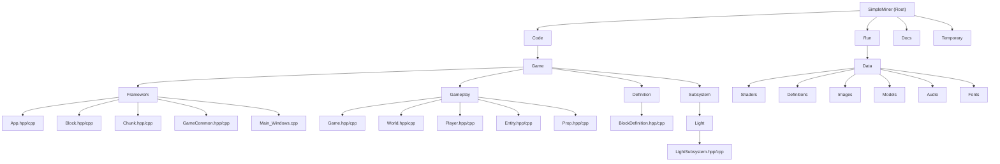

# SimpleMiner - Voxel Game Engine

## Changelog
- **2025-09-30**: Implemented multi-threaded chunk system with JobSystem integration
  - Added dedicated I/O worker thread for disk operations
  - Implemented asynchronous chunk generation, loading, and saving
  - Added comprehensive mutex protection for thread-safe world management
  - Fixed critical job processing bug preventing chunk generation
- **2025-09-13**: Initial AI context documentation created
- **Recent Commits**: Fixed Game.vcxproj relative paths, resolved compiler warnings and DirectX 11 memory leaks, added NuGet configuration for V8 integration, implemented proper chunk rendering system

## Project Vision

SimpleMiner (internally named DaemonCraft) is a modern 3D voxel-based game engine built in C++ with DirectX 11 rendering. The project demonstrates advanced game engine architecture patterns, including chunk-based world generation, block systems, JavaScript integration via V8, and professional audio through FMOD. The engine supports both debug and release builds with optimized rendering pipelines for Minecraft-like gameplay experiences.

## Architecture Overview

The project follows a modular architecture with clear separation between engine core and game logic:

- **Custom Engine Architecture**: Built on a separate engine project with modular subsystems
- **Multi-threaded Job System**: Asynchronous chunk generation with (N-1) worker threads
  - 1 dedicated I/O thread for disk operations (LoadChunkJob, SaveChunkJob)
  - (N-2) generic threads for computation (ChunkGenerateJob)
  - Thread-safe chunk state machine with std::atomic transitions
- **DirectX 11 Rendering**: Modern GPU-accelerated graphics with HLSL shaders
- **Chunk-based World System**: Efficient voxel storage and rendering using 16x16x128 block chunks
  - Asynchronous chunk loading/generation with thread-safe activation
  - RLE-compressed disk I/O for persistent world saves
  - Mutex-protected shared data structures
- **Block Definition System**: Data-driven block types with XML configuration
- **V8 JavaScript Integration**: Embedded scripting engine for game logic
- **FMOD Audio**: Professional audio system for immersive sound design
- **Entity-Component Architecture**: Flexible system for game objects and players

## Module Structure Diagram

## Module Index

| Module | Path | Responsibility |
|--------|------|---------------|
| **Game Core** | `Code/Game/` | Main game logic, entry points, and build configuration |
| **Framework** | `Code/Game/Framework/` | Core game systems including App, Block, Chunk management |
| **Gameplay** | `Code/Game/Gameplay/` | Game-specific logic including World, Player, Entities |
| **Definitions** | `Code/Game/Definition/` | Data-driven configuration for blocks and game elements |
| **Subsystems** | `Code/Game/Subsystem/` | Specialized systems like lighting and rendering |
| **Runtime Assets** | `Run/` | Executable, game data, shaders, models, and configurations |

## Running and Development

### Prerequisites
- **Visual Studio 2022** with C++ development tools
- **Windows 10/11 x64**
- **DirectX 11 SDK** (included with Windows SDK)
- **Git** with submodule support

### Build Process
1. Open `SimpleMiner.sln` in Visual Studio
2. Ensure Engine submodule is properly initialized
3. Select configuration: Debug|x64 or Release|x64
4. Build → Build Solution (F7)
5. Executables are copied to `Run/` directory

### Running the Game
- **Debug**: Run `SimpleMiner_Debug_x64.exe` from `Run/` directory
- **Release**: Run `SimpleMiner_Release_x64.exe` from `Run/` directory
- Game assets are loaded from `Run/Data/` subdirectories

## Testing Strategy

- **Integration Testing**: Engine-game boundary testing through App class
- **Rendering Validation**: DirectX 11 resource management and chunk rendering
- **Performance Testing**: Chunk generation and mesh rebuilding performance
- **Memory Management**: Proper cleanup of DirectX resources and V8 contexts
- **Configuration Testing**: XML parsing and block definition validation

## Coding Standards

- **C++20 Standard**: Modern C++ features with `/std:c++20` compiler flag
- **Engine Separation**: Game code includes Engine headers but not vice versa
- **Memory Management**: RAII patterns for DirectX and game resources
- **Naming Convention**: PascalCase for classes, camelCase for variables, m_ prefix for members
- **Header Organization**: Forward declarations, includes, implementation separation
- **Performance First**: Cache-friendly data structures, especially for chunk storage

## AI Usage Guidelines

- **Architecture Understanding**: Focus on the relationship between Chunk, Block, and World systems
- **Rendering Pipeline**: Understand DirectX 11 resource management and HLSL shader integration
- **Data Flow**: Trace from XML definitions through BlockDefinition to runtime Block instances
- **Performance Considerations**: Chunk mesh rebuilding is expensive, understand when it triggers
- **V8 Integration**: JavaScript scripting is available but implementation details may need investigation
- **External Dependencies**: Engine project provides core functionality, FMOD handles audio, V8 provides scripting

## Key Technical Details

- **Chunk Size**: 16x16x128 blocks (CHUNK_SIZE_X/Y/Z constants)
- **Block Storage**: Ultra-lightweight 1-byte Block class with type index
- **World Coordinates**: 1 meter per block, infinite X/Y, finite Z (0-128)
- **Rendering**: Vertex/Index buffer management with mesh rebuilding
- **Texture Mapping**: Sprite sheet system for block face textures
- **Configuration**: XML-driven game and block definitions